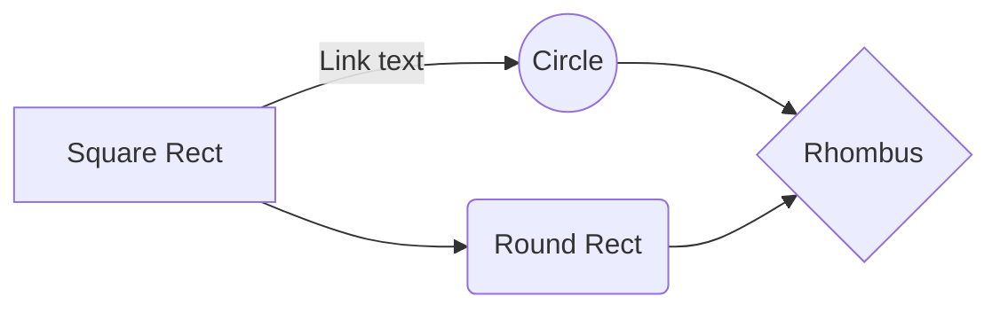

# JSON schema files for Cat Tracker application

Hi! I'm your first Markdown file in **StackEdit**. If you want to learn about StackEdit, you can read me. If you want to play with Markdown, you can edit me. Once you have finished with me, you can create new files by opening the **file explorer** on the left corner of the navigation bar.

## Topics and overall communications

## Dynamic parameters

**pubint** = publishing interval: Decides how often the device should publish data. This parameter is not an exact representation of publishing interval, the actual publishing time is the publishing interval + the additional time required to get a gps fix).

**gpst** = gps threshold: Decides the duration of time spent on obtaining a a gps fix. When the device breaks the threshold limit it will go to sleep for the duration of the publishing time, and try again upon the next publishing cycle.

**mode** = tracking mode: Mode can either be true or false representing either an active tracking mode, or an passive tracking mode.

## Sensor Data

**gps** = gps data.
**long** = longitude.
**lat** = latitude.
**bat** = battery status: Contains battery status in percent.
  
## Tracking Modes

The device supports two tracking modes, active and passive. These modes are configurable via the mode JSON object. When mode is set to true, active mode is enabled and when mode is set to false, passive mode is enabled.
**Active Mode(mode = true):** In active mode the device publishes data every publishing interval.
**Passive Mode(mode=false):** In passive mode the device publishes data every publishing interval as long as the subject wearing the device is actually in movement. When the subject is for instance sleeping or standing still, the device will not publish data.
